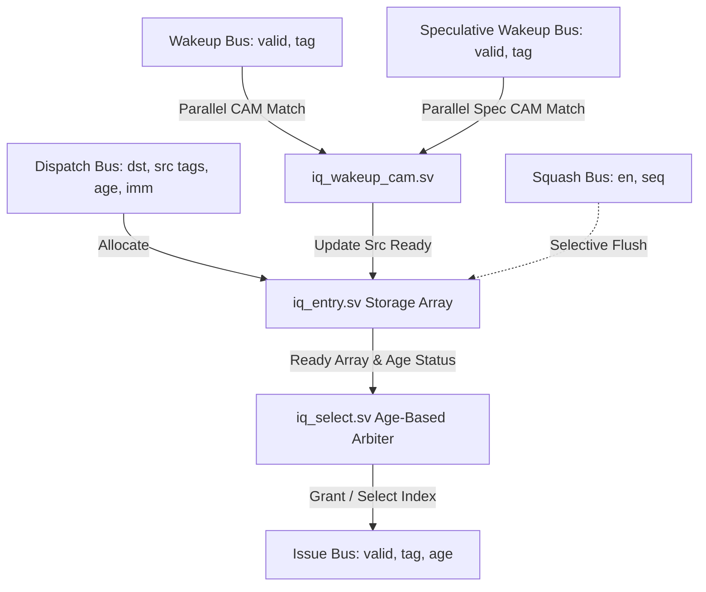

# Out-of-Order Parametric Issue Queue (IQ)

A high-performance, parametric SystemVerilog implementation of an Out-of-Order (OoO) Issue Queue (also known as Reservation Stations). This IP acts as the scheduling hub of a superscalar processor, holding instructions dispatched from the front-end, waking them up when their data dependencies are satisfied, and selecting the oldest ready instructions for execution.

---

## Key Features

- **Fully Parametric Design**: Configure queue depth (`DEPTH`), issue width/ports (`NUM_PORTS`), tag width (`TAG_WIDTH`), and source operand count (`NUM_SRC`) at instantiation.
- **Age-Based Select Arbitrator**: Prioritizes older instructions over younger ones using age comparison to prevent starvation and ensure high-throughput execution.
- **Parallel CAM-Based Wakeup**: Content-Addressable Memory (CAM) broadcasts completed destination tags to all entries in a single clock cycle.
- **Speculative Wakeup**: Integrates a speculative wakeup bus, allowing dependent instructions to wake up and issue one cycle early (assuming single-cycle execution latency of producers).
- **Selective Branch Squashing**: Supports age-based branch recovery using sequence numbers (`disp_seq`). Automatically clears entries younger than a mispredicted branch while retaining older, valid instructions.
- **Robust SVA Monitor**: Bind-based SystemVerilog Assertions (SVA) formally verify safety (no double issues, no non-ready issues) and liveness (bounded queue lifetime/starvation protection).
- **Constrained-Random Verification (CRV)**: UVM-inspired transaction-based testbench with functional coverage metrics (achieving >96% coverage over 20,000 randomized cycles).

---

## Block Diagram



---

## Codebase Architecture

```
├── rtl/
│   ├── iq_pkg.sv          # SystemVerilog Package (Parameters, struct definitions)
│   ├── iq_entry.sv        # Individual storage slot with dependency tracking & squash logic
│   ├── iq_wakeup_cam.sv   # CAM broadcaster that routes wakeup buses to entries
│   ├── iq_select.sv       # Multi-port age-based selection & priority encoder tree
│   └── iq_top.sv          # Top-level integration & free-list tracker
├── sva/
│   └── iq_assertions.sv   # Bound SVA properties for safety and liveness
├── tb/
│   ├── tb_iq_entry.sv     # Unit testbench for a single slot
│   ├── tb_iq_wakeup_cam.sv# Unit testbench for the CAM broadcast array
│   ├── tb_iq_select.sv    # Unit testbench for the select arbiter
│   ├── tb_iq_top_directed.sv # Top-level integration directed tests
│   └── tb_iq_top_random.sv   # Constrained-random environment with covergroups
└── sim/
    └── scripts/
        └── Makefile       # Simulation control script (supports Cadence Xcelium)
```

---

## Deep Dive: Key Microarchitectural Mechanisms

### 1. Age-Based Selection
Unlike a simple FIFO queue, the Issue Queue must handle instructions that finish their dependencies out-of-order. If multiple instructions become ready at the same time, the queue must issue the **oldest** instruction first. 
- In `iq_select.sv`, we implement age comparison using age tags (`disp_seq` tracked at dispatch). 
- A multi-port selection matrix compares every ready instruction's age and filters out younger instructions, ensuring that the oldest ready instructions are routed to the available issue ports.

### 2. Speculative Wakeup & The Replay Problem
To hide execution latency, the queue supports a secondary **Speculative Wakeup Bus**. If instruction `A` is dispatched and depends on instruction `B` (which takes 1 cycle to execute), instruction `A` can wake up *before* `B` actually finishes writing back. It speculatively assumes `B` will complete successfully.
* **Benefits**: Saves 1 cycle of execution bubble.
* **The Replay Problem**: If a cache miss or execution hazard stalls instruction `B`, instruction `A` has already issued and must be *canceled and re-issued* (replayed). To keep compilation complexity clean, our RTL implements the speculative trigger path, but documents the trade-offs of storing issued instructions for verification/poison-tracking.

### 3. Branch Squashing
When a branch instruction is mispredicted, the processor must flush all instructions that were speculatively fetched after it:
- At dispatch, every instruction is tagged with a monotonically increasing sequence number (`disp_seq`).
- On a branch misprediction (`squash_en = 1`), the execution pipeline broadcasts the sequence number of the mispredicted branch (`squash_seq`).
- In `iq_entry.sv`, each entry compares its own sequence number with `squash_seq`. If `entry.disp_seq > squash_seq`, the entry is immediately cleared, while older instructions continue execution unaffected.

---

## Verification Strategy

### Directed Testing
Located in `tb/tb_iq_top_directed.sv`. Exercises 10 distinct, hand-crafted scenarios:
1. `single_chain`: Classic A → B dependency wakeup.
2. `multi_ready`: Verification that the oldest instruction issues first when multiple are ready.
3. `backpressure`: Queue saturation behavior and stalling.
4. `bypass_dispatch`: Same-cycle dispatch and wakeup (zero-cycle bypass).
5. `immediate_src`: Dispatching ready instructions with immediate operands.
6. `multi_port_issue`: Verification of simultaneous issues across multiple ports.
7. `age_ordering`: Strict oldest-first validation.
8. `slot_reuse`: Verification that freed queue slots are immediately re-allocated.
9. `squash_selective`: Age-based branch flush test.
10. `speculative_wakeup`: Early wakeup verification.

### SystemVerilog Assertions (SVA)
Bound cleanly inside `sva/iq_assertions.sv` to run in parallel with the simulation:
- **No-Issue-While-Not-Ready**: Asserts that an issue port never grants a slot index if that slot's instruction is not ready.
- **Mutual Exclusion**: Asserts that two issue ports never select the same slot index simultaneously.
- **Bounded-Issue Liveness**: Ensures that once an instruction is allocated into a physical queue slot, it is guaranteed to leave the queue (either by issuing or by being squashed) within 1,000 clock cycles.

### Constrained-Random & Functional Coverage
Located in `tb/tb_iq_top_random.sv`. Generates chaotic transaction-based patterns simulating heavy processor load:
- Dynamic weights balance dispatch, wakeup, and squash occurrences.
- Covergroups measure queue occupancy (Empty, Partially Full, Full), wakeup hits, squash frequencies, and issue-port distribution.
- **Result**: Attains **96.30% functional coverage** over a 20,000-cycle simulation.

---

## How to Simulate

Ensure a SystemVerilog simulator (e.g., Cadence Xcelium) is installed and in your PATH.

### 1. Run Directed Tests
```bash
make -f sim/scripts/Makefile sim_top_dir
```

### 2. Run Constrained-Random Coverage Simulation
```bash
make -f sim/scripts/Makefile sim_top_rand
```

### 3. Clean Temp Files
```bash
make -f sim/scripts/Makefile clean
```
