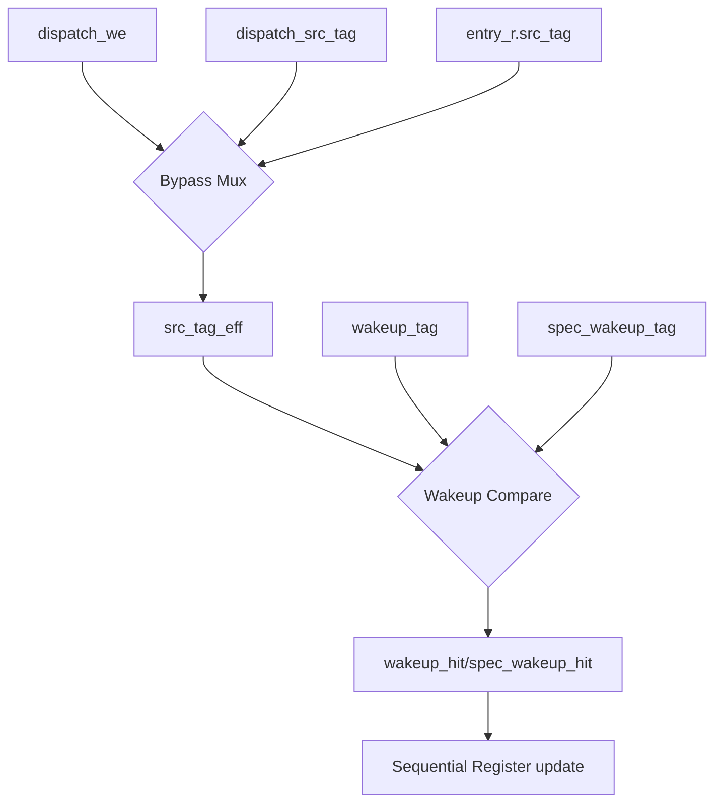

# `iq_entry.sv` — Individual Queue Slot Reference

The `iq_entry` module represents a single physical instruction slot inside the Issue Queue. It stores all information about an instruction (destination tag, source tags, readiness, age, and ticket number) and performs continuous comparisons against the global wakeup bus to resolve dependencies.

---

## 1. Interface Signals

| Signal Name | Width | Direction | Description |
| :--- | :---: | :---: | :--- |
| **`clk`** | `1` | `input` | **Clock Signal.** Main system clock. State transitions happen on the rising edge. |
| **`rst_n`** | `1` | `input` | **Active-Low Reset.** When pulled low, instantly clears the slot (valid is set to `0`, ready bits and age are reset). |
| **`dispatch_we`** | `1` | `input` | **Write Enable (Load Slot).** Driven by the allocator. When `1`, the slot accepts and stores the arriving instruction data. |
| **`dispatch_dst_tag`**| `TAG_WIDTH` | `input` | **Dispatch Destination Tag.** The destination register nametag of the new instruction. |
| **`dispatch_src_tag`**| `[NUM_SRC-1:0][TAG_WIDTH-1:0]` | `input` | **Dispatch Source Tags.** The input register nametags of the new instruction. |
| **`dispatch_src_imm`**| `[NUM_SRC-1:0]` | `input` | **Dispatch Source Immediate mask.** If bit `i` is `1`, source `i` is a constant and is marked ready immediately. |
| **`dispatch_disp_seq`**| `16` | `input` | **Dispatch Sequence Ticket.** The arrival number assigned to this instruction. |
| **`wakeup_valid`** | `1` | `input` | **Wakeup Broadcast Valid.** Indicates a producer has completed and is broadcasting a tag. |
| **`wakeup_tag`** | `TAG_WIDTH` | `input` | **Wakeup Broadcast Tag.** The destination tag of the completing instruction. |
| **`spec_wakeup_valid`**| `1` | `input` | **Speculative Wakeup Valid.** Indicates an early, speculative wakeup tag is being broadcast. |
| **`spec_wakeup_tag`** | `TAG_WIDTH` | `input` | **Speculative Wakeup Tag.** The tag broadcast early by a producer (e.g., load instructions predicting hit). |
| **`issue_clear`** | `1` | `input` | **Clear on Issue.** Driven by the selector. When `1`, it means this instruction has been chosen to execute; the slot is cleared. |
| **`squash_clear`** | `1` | `input` | **Clear on Squash.** Driven by the squash logic. When `1`, it means this instruction was dispatched after a mispredicted branch and must be discarded. |
| **`entry_o`** | Struct | `output` | **Slot State Output.** Outputs the entire `iq_entry_t` struct containing the slot's current register contents. |
| **`ready_o`** | `1` | `output` | **Instruction Ready Indicator.** Asserted combinationally if `valid == 1` and all source operands are ready. |

---

## 2. Walkthrough of Internal Logic Blocks



### Block 1: Same-Cycle Dispatch & Wakeup Bypass (`src_tag_eff_calc`)
```systemverilog
always_comb begin : src_tag_eff_calc
    for (int i = 0; i < NUM_SRC; i++) begin
        src_tag_eff[i] = dispatch_we ? dispatch_src_tag[i]
                                     : entry_r.src_tag[i];
    end
end
```
- **What it does:** Calculates the **effective** source tags (`src_tag_eff`) for this cycle. If a new instruction is writing to this slot this cycle (`dispatch_we` is `1`), we look at the incoming tags (`dispatch_src_tag`). Otherwise, we look at the stored tags (`entry_r.src_tag`).
- **Why it is needed:** Without this bypass, a same-cycle wakeup bug would occur. If instruction $A$ completes and broadcasts its tag $T$ on the wakeup bus in the **same cycle** that a new instruction $B$ (which depends on tag $T$) is written to this slot, $B$'s internal register `entry_r.src_tag` would not store tag $T$ until the *next* clock cycle. The comparator would look at the stale contents of the slot, miss the wakeup broadcast, and instruction $B$ would hang forever. By bypassing the register and comparing against the incoming data directly, we catch this wakeup.

---

### Block 2: Wakeup Comparators (`wakeup_compare`)
```systemverilog
always_comb begin : wakeup_compare
    for (int i = 0; i < NUM_SRC; i++) begin
        wakeup_hit[i] = wakeup_valid && (wakeup_tag == src_tag_eff[i]);
        spec_wakeup_hit[i] = spec_wakeup_valid && (spec_wakeup_tag == src_tag_eff[i]);
    end
end
```
- **What it does:** Pairwise compares the effective source tags against the incoming normal and speculative wakeup broadcast tags.
- **Why it is here:** Generates immediate hit signals if a producer completes this cycle. Both normal completion (`wakeup_hit`) and speculative early-wakeup completion (`spec_wakeup_hit`) are evaluated.

---

### Block 3: Sequential State Machine (`entry_state`)
This block runs on `posedge clk` or `negedge rst_n` and manages the stored register `entry_r`.

1. **Reset (`!rst_n`):**
   - Resets the entire register structure to zero.

2. **Dispatch Write (`dispatch_we`):**
   - Sets `valid` to `1`.
   - Stores the destination and source tags.
   - Sets the initial `src_ready` bitmask. This is computed combinationally as:
     `dispatch_src_imm | wakeup_hit | spec_wakeup_hit`
     *This means an input is ready if it is a constant, or if its producer broadcasts a completion in this exact cycle.*
   - Resets `age` to `0` and stores the dispatch ticket number (`dispatch_disp_seq`).

3. **Clear (`issue_clear || squash_clear`):**
   - Sets `valid` to `0`, clearing the slot.
   - Resets `src_ready` and `age` to zero to clean waveforms and prevent stale state leakage.

4. **Active State Updates (`entry_r.valid`):**
   - **Sticky Wakeups:** `entry_r.src_ready <= entry_r.src_ready | wakeup_hit | spec_wakeup_hit;`
     Once a source operand becomes ready, it stays ready. If another source matches a wakeup broadcast this cycle, its corresponding bit is set.
   - **Saturating Age Counter:**
     `entry_r.age <= (entry_r.age == iq_pkg::AGE_SAT_MAX) ? iq_pkg::AGE_SAT_MAX : entry_r.age + 1'b1;`
     Increments the age of the instruction every cycle. If it hits the maximum value (`AGE_SAT_MAX`, e.g. `15`), it holds that maximum value. This prevents the counter from wrapping back to `0`, which would make an extremely old instruction look new and cause it to wait indefinitely.

---

## 3. Connections to Other Modules

- **Parent (`iq_wakeup_cam.sv`)**: Stamped out `DEPTH` times in a generate loop. The parent handles the wiring, decodes the write-enable and clear signals, and broadcasts the global wakeup buses to all slots in parallel.
- **Consumer (`iq_select.sv`)**: Reads the state output (`entry_o`) and readiness bit (`ready_o`) of every slot to select which instructions should run.
