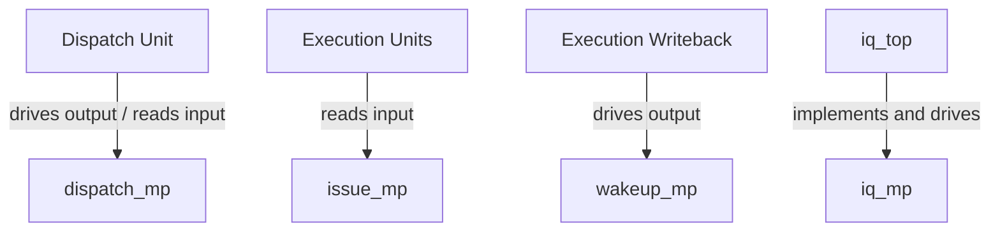

# `iq_if.sv` — Issue Queue Bus Interface Reference

The `iq_if` interface defines the communication protocols and physical signal connections between the Issue Queue and the rest of the processor. It groups related signals into logical channels and defines restricted access views (modports) for each unit connected to the queue.

---

## 1. Parameters

- **`DEPTH`** (Default: `16`): Sizing configuration for index calculation.
- **`TAG_WIDTH`** (Default: `6`): Sizing of instruction tags.
- **`NUM_SRC`** (Default: `2`): Sizing of the source register array.
- **`NUM_PORTS`** (Default: `2`): Number of instructions that can issue in parallel.
- **`IDX_WIDTH`** (Localparam: `$clog2(DEPTH)`): The bit width required to address a specific slot in the queue (e.g., 4 bits for a depth of 16).

---

## 2. Signal Breakdown

The interface contains three signal groups, representing three distinct communication interfaces.

### Group 1: Dispatch Interface (Dispatch Unit $\rightarrow$ Issue Queue)
These signals manage the arrival of new instructions into the queue.

| Signal | Width | Direction in `iq_top` | Description |
| :--- | :---: | :---: | :--- |
| **`dispatch_valid`** | `1` | `input` | **New Instruction Alert.** Driven by the dispatch unit to tell the queue that a new instruction is ready to be written into the queue. |
| **`dispatch_dst_tag`** | `TAG_WIDTH` | `input` | **Destination Tag.** The nametag associated with this new instruction's output register. |
| **`dispatch_src_tag`** | `[NUM_SRC-1:0][TAG_WIDTH-1:0]` | `input` | **Source Tags.** An array of nametags representing the registers this instruction needs to read as input. |
| **`dispatch_src_imm`** | `[NUM_SRC-1:0]` | `input` | **Immediate/Constant Indicators.** A bitmask where bit `i` is set to `1` if input `i` is an immediate value (or constant) rather than a register. If it is `1`, the queue does not wait for a wakeup broadcast for this source. |
| **`dispatch_ready`** | `1` | `output` | **Queue Ready Flag.** Driven by the issue queue. `1` means the queue is not full and can accept a new instruction. If `0`, the dispatch unit must stall (hold its output). |
| **`dispatch_slot_idx`** | `IDX_WIDTH` | `output` | **Target Slot Index.** Driven by the issue queue. Indicates the exact physical slot index where the newly dispatched instruction is being stored. |

---

### Group 2: Wakeup Interface (Execution Writeback $\rightarrow$ Issue Queue)
These signals broadcast the completion of instructions so that waiting instructions in the queue can mark their inputs as ready.

| Signal | Width | Direction in `iq_top` | Description |
| :--- | :---: | :---: | :--- |
| **`wakeup_valid`** | `1` | `input` | **Wakeup Broadcast Valid.** Driven by an execution unit when it completes an instruction and is broadcasting a result tag. |
| **`wakeup_tag`** | `TAG_WIDTH` | `input` | **Wakeup Tag.** The nametag of the destination register that has just been computed. Any instruction in the queue waiting on a matching tag will set its respective `src_ready` bit. |

---

### Group 3: Issue Interface (Issue Queue $\rightarrow$ Execution Units)
These signals command the execution units to run ready instructions.

| Signal | Width | Direction in `iq_top` | Description |
| :--- | :---: | :---: | :--- |
| **`issue_valid`** | `NUM_PORTS` | `output` | **Issue Port Valid.** Active-high signals indicating that a ready instruction is being issued on execution port `p`. |
| **`issue_idx`** | `[NUM_PORTS-1:0][IDX_WIDTH-1:0]` | `output` | **Issued Slot Index.** Indicates which physical queue slot the issued instruction is leaving. |
| **`issue_dst_tag`** | `[NUM_PORTS-1:0][TAG_WIDTH-1:0]` | `output` | **Issued Destination Tag.** The destination register nametag of the issuing instruction. |
| **`issue_age`** | `[NUM_PORTS-1:0][AGE_WIDTH-1:0]` | `output` | **Issued Instruction Age.** The age value of the issued instruction, provided for debug tracking and execution priority management. |

---

## 3. Modports (Restricted Interface Views)

Modports define how different modules view this interface. They restrict which signals can be read (`input`) or written (`output`) by specific hardware blocks.

### 1. `dispatch_mp` (For the Dispatch Unit)
- **Role:** Allows the dispatch unit to drive new instructions and read the backpressure signal.
- **Signals:**
  - `output` (Drives): `dispatch_valid`, `dispatch_dst_tag`, `dispatch_src_tag`, `dispatch_src_imm`.
  - `input` (Reads): `dispatch_ready`, `dispatch_slot_idx`.

### 2. `wakeup_mp` (For the Writeback/Wakeup Source)
- **Role:** Allows execution units to broadcast completing register tags.
- **Signals:**
  - `output` (Drives): `wakeup_valid`, `wakeup_tag`.

### 3. `issue_mp` (For the Execution Units)
- **Role:** Allows execution units to receive issued instructions.
- **Signals:**
  - `input` (Reads): `issue_valid`, `issue_idx`, `issue_dst_tag`, `issue_age`.

### 4. `iq_mp` (For the Issue Queue Top-Level `iq_top`)
- **Role:** Connects all external blocks to `iq_top`. By convention, the issue queue reads all dispatch/wakeup commands and drives backpressure and issue grants.
- **Signals:**
  - `input` (Reads): `dispatch_valid`, `dispatch_dst_tag`, `dispatch_src_tag`, `dispatch_src_imm`, `wakeup_valid`, `wakeup_tag`.
  - `output` (Drives): `dispatch_ready`, `dispatch_slot_idx`, `issue_valid`, `issue_idx`, `issue_dst_tag`, `issue_age`.

---

## 4. How it Connects to Other Files

- **`iq_top.sv`**: To maintain maximum portability, `iq_top.sv` exposes raw input/output port pins rather than instantiating this interface inside its port list. This allows the compiler to bind `iq_top` without forcing a testbench to use SystemVerilog interfaces.
- **Testbench / System Wrapper (`tb/tb_iq_top_random.sv` / `tb/tb_iq_top_directed.sv`)**: Instantiates `iq_if` globally and connects its wires to the ports of `iq_top`. It binds the dispatch generator to `iq_if.dispatch_mp`, execution units to `iq_if.issue_mp`, and writeback buses to `iq_if.wakeup_mp`.
