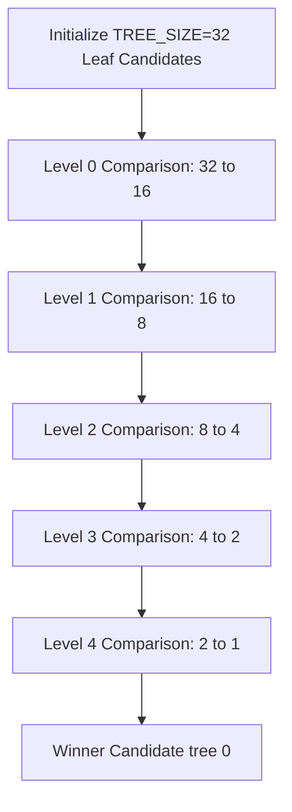

# `iq_select.sv` — Age-Ordered Selector Reference

The `iq_select` module is a purely combinational block (no clock, no internal flip-flops) that runs every cycle. It inspects all valid and ready instructions inside the Issue Queue, compares their ages, and selects up to `NUM_PORTS` of the oldest instructions to execute. It guarantees mutual exclusion, meaning no single instruction slot is assigned to two execution ports at the same time.

---

## 1. Port Interface Signals

| Port Name | Width | Direction | Description |
| :--- | :---: | :---: | :--- |
| **`entry_i`** | Array of structs | `input` | **Entries State Input.** The array of all `DEPTH` slot structs from the CAM. Used to read the age and destination tags of each instruction. |
| **`ready_i`** | `DEPTH` | `input` | **Readiness Mask.** A bitmask where bit `i` is `1` if slot `i` is currently valid and ready to execute. |
| **`grant_o`** | `NUM_PORTS` | `output` | **Issue Grants.** Bit `p` is `1` if port `p` successfully found an eligible instruction to issue. |
| **`grant_idx_o`** | `[NUM_PORTS-1:0][$clog2(DEPTH)-1:0]`| `output` | **Issued Slot Indices.** Array indicating which physical queue slot was selected for each port. |
| **`grant_tag_o`** | `[NUM_PORTS-1:0][TAG_WIDTH-1:0]`| `output` | **Issued Destination Tags.** Array of destination register tags of the issued instructions (needed for execution tracking). |
| **`grant_age_o`** | `[NUM_PORTS-1:0][AGE_WIDTH-1:0]`| `output` | **Issued Instruction Ages.** Array of age values for the selected instructions (mainly used for debug tracing). |

---

## 2. In-Depth Algorithmic Walkthrough



### 1. The Candidate Struct (`candidate_t`)
```systemverilog
typedef struct packed {
    logic                 valid;
    logic [IDX_W-1:0]     idx;
    logic [AGE_WIDTH-1:0] age;
} candidate_t;
```
To simplify comparison logic, we pack only the relevant data needed for selection into a small, temporary candidate record:
- `valid`: `1` if this candidate represents a real, ready instruction.
- `idx`: The physical slot index (0 to 15) this instruction sits in.
- `age`: How long the instruction has been waiting.

### 2. Pairwise Comparator Node (`pick_older`)
```systemverilog
function automatic candidate_t pick_older(input candidate_t a, input candidate_t b);
```
This function compares two candidates and returns the winner. It resolves matches using three hierarchical rules:
1. **Validity Rule:** If only one candidate is real (valid), it wins automatically. If neither is valid, it returns an invalid candidate.
2. **Age Rule:** If both are valid, it compares their age counters using `iq_pkg::age_older_than`. The one with the larger age counter wins.
3. **Starvation Tie-Break:** If both are valid and have the exact same age (which happens if they were dispatched in the same cycle), the candidate with the **lower slot index** (`a.idx <= b.idx`) wins. This prevents starvation by guaranteeing a predictable tie-break.

### 3. Tournament reduction tree (`find_oldest_ready`)
```systemverilog
function automatic candidate_t find_oldest_ready(
    input iq_pkg::iq_entry_t entry_arr [DEPTH],
    input logic [DEPTH-1:0]  mask
);
```
To find the oldest instruction out of up to 16 options, we use a binary reduction tree, similar to a tournament bracket:
- **Leaf Sizing:** The tree is sized to a power of 2 (`TREE_SIZE = 32`). This is large enough to handle up to 32 entries.
- **Leaf Initialization:** We populate the first 16 leaf slots of the tree with candidates representing the queue entries. If an entry is ready and allowed by the `mask`, we set `valid = 1` and fill in its index and age. The remaining slots (up to index 31) are padded with invalid candidates (`valid = 0`).
- **Reduction Loop:** We loop, halving the active tree size at each level:
  `tree[i] = pick_older(tree[2*i], tree[2*i+1]);`
  This reduces the pool: Level 0 (32 candidates $\rightarrow$ 16 winners), Level 1 (16 $\rightarrow$ 8), Level 2 (8 $\rightarrow$ 4), Level 3 (4 $\rightarrow$ 2), Level 4 (2 $\rightarrow$ 1 winner).
  The final winner is returned in `tree[0]`.

### 4. Multi-Port Allocation & Mutual Exclusion (`multi_port_select`)
```systemverilog
always_comb begin : multi_port_select
    logic [DEPTH-1:0] current_mask;
    candidate_t       winner;
    current_mask = ready_i;
    for (int p = 0; p < NUM_PORTS; p++) begin
        winner = find_oldest_ready(entry_i, current_mask);
        grant_o[p]     = winner.valid;
        grant_idx_o[p] = winner.idx;
        ...
        if (winner.valid) begin
            current_mask[winner.idx] = 1'b0;
        end
    end
end
```
If we want to issue up to 2 instructions in a cycle (`NUM_PORTS = 2`), we cannot simply run the selection tree once, as it would return the same oldest instruction for both ports. Instead, we run the selection tree in a sequential loop:
1. **Initialize Eligible Mask:** We start with all ready instructions (`current_mask = ready_i`).
2. **Select for Port 0:** We run the tournament tree. It finds the oldest ready instruction. We assign it to port 0 (`grant_idx_o[0]`).
3. **Mask Out Winner:** If we found a winner, we cross it off the list by clearing its bit in the mask (`current_mask[winner.idx] = 0`).
4. **Select for Port 1:** We run the tournament tree again. Because the port 0 winner has been masked out, the tree is forced to find the next oldest ready instruction, which is assigned to port 1 (`grant_idx_o[1]`).

---

## 3. Connections to Other Modules

- **Parent (`iq_top.sv`):** Provides the inputs from the CAM and connects the outputs directly to the issue bus.
- **Feedback Loop:** The grant outputs (`sel_grant` and `sel_idx`) are routed back as inputs to the CAM (`issue_grant` and `issue_idx`). This feedback loop ensures that any slot issued this cycle is instantly cleared on the next rising clock edge, freeing the slot for new instructions.
