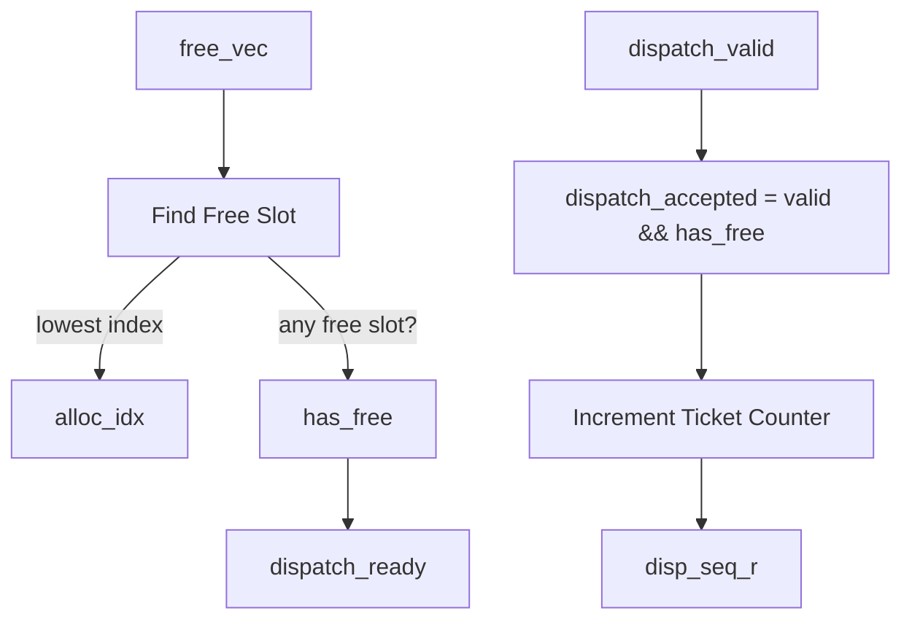

# `iq_top.sv` — Top-Level Integration Reference

The `iq_top` module integrates all sub-blocks of the Issue Queue into a single, cohesive unit. It acts as the system coordinator: allocating free slots, managing the queue's state update logic, counting global instruction ticket numbers, and routing the signals between the memory CAM (`iq_wakeup_cam`) and the age-priority selector (`iq_select`).

---

## 1. External Port Interface

These signals correspond to the `iq_mp` modport defined in `iq_if.sv`.

| Port Name | Width | Direction | Description |
| :--- | :---: | :---: | :--- |
| **`clk`** | `1` | `input` | **Clock.** Rising edge triggers state updates in CAM slots, sequence counters, and the allocation map. |
| **`rst_n`** | `1` | `input` | **Active-Low Reset.** Clears all state, making all queue slots empty. |
| **`dispatch_valid`** | `1` | `input` | **Incoming Instruction Ready.** Asserted by the dispatch unit. |
| **`dispatch_dst_tag`** | `TAG_WIDTH` | `input` | **Destination Tag.** Register nametag for the incoming instruction. |
| **`dispatch_src_tag`** | `[NUM_SRC-1:0][TAG_WIDTH-1:0]`| `input` | **Source Tags.** Register nametags for the incoming instruction. |
| **`dispatch_src_imm`** | `[NUM_SRC-1:0]` | `input` | **Immediate mask.** Indicates if a source is a constant (ready instantly). |
| **`dispatch_ready`** | `1` | `output` | **Queue Ready.** Asserted if the queue has at least one empty slot. |
| **`dispatch_slot_idx`**| `[$clog2(DEPTH)-1:0]`| `output` | **Allocated Slot Index.** Tells the dispatch unit where the instruction is being stored. |
| **`wakeup_valid`** | `1` | `input` | **Wakeup Valid.** Broadcasts that a producer instruction has completed. |
| **`wakeup_tag`** | `TAG_WIDTH` | `input` | **Wakeup Tag.** The destination tag of the completing instruction. |
| **`spec_wakeup_valid`**| `1` | `input` | **Speculative Wakeup Valid.** Broadcasts early completion. |
| **`spec_wakeup_tag`** | `TAG_WIDTH` | `input` | **Speculative Wakeup Tag.** The speculative tag of the completing instruction. |
| **`issue_valid`** | `NUM_PORTS` | `output` | **Issue Valid.** Active-high issue indicators for each execution port. |
| **`issue_idx`** | `[NUM_PORTS-1:0][$clog2(DEPTH)-1:0]`| `output` | **Issued Slot Index.** The slot numbers of the issued instructions. |
| **`issue_dst_tag`** | `[NUM_PORTS-1:0][TAG_WIDTH-1:0]`| `output` | **Issued Destination Tag.** The destination tags of the issued instructions. |
| **`issue_age`** | `[NUM_PORTS-1:0][AGE_WIDTH-1:0]`| `output` | **Issued Age.** The ages of the issued instructions. |
| **`squash_en`** | `1` | `input` | **Branch Misprediction Flush En.** Asserted to trigger a pipeline flush. |
| **`squash_seq`** | `16` | `input` | **Squash Sequence.** The ticket number of the mispredicted branch. |

---

## 2. Internal Signals & Wires

- **`entry_array`** (Type: `iq_entry_t [DEPTH]`): Carries the complete state of all physical queue slots from the CAM to the selector.
- **`ready_array`** (Width: `DEPTH`): A bitmask where bit `i` is `1` if slot `i` is valid and ready to execute, passed from the CAM to the selector.
- **`sel_grant`** (Width: `NUM_PORTS`): Grant lines output by the selector indicating if an instruction was found for each port.
- **`sel_idx`** (Width: `[NUM_PORTS-1:0][IDX_W-1:0]`): Target queue slot indices selected by the selector.
- **`sel_tag`** (Width: `[NUM_PORTS-1:0][TAG_WIDTH-1:0]`): Destination register tags of selected instructions.
- **`sel_age`** (Width: `[NUM_PORTS-1:0][AGE_WIDTH-1:0]`): Age counters of selected instructions.
- **`free_vec`** (Width: `DEPTH`): An internal allocation map. Bit `i` is `1` if slot `i` is currently empty/available.
- **`alloc_idx`** (Width: `IDX_W`): The index of the first empty slot found by the allocator.
- **`has_free`** (Width: `1`): Set to `1` if at least one slot in the queue is empty.
- **`dispatch_accepted`** (Width: `1`): Set to `1` if a new instruction is arriving AND the queue has room.
- **`disp_seq_r`** (Width: `16`): The global ticket counter register.

---

## 3. Walkthrough of Control Blocks



### Block 1: Free Slot Allocator (`find_free_slot`)
```systemverilog
always_comb begin : find_free_slot
    alloc_idx = '0;
    has_free  = 1'b0;
    for (int i = 0; i < DEPTH; i++) begin
        if (free_vec[i] && !has_free) begin
            alloc_idx = i[IDX_W-1:0];
            has_free  = 1'b1;
        end
    end
end
```
- **What it does:** Scans the `free_vec` allocation map from slot 0 up to 15. It stops at the **first** empty slot it encounters (`free_vec[i] == 1`).
- **Why it is here:** Implements a priority-based allocator. It ensures we always write new instructions into the lowest available slot index, keeping allocation deterministic.

### Block 2: Global Ticket Counter (`disp_seq_counter`)
```systemverilog
always_ff @(posedge clk or negedge rst_n) begin : disp_seq_counter
    if (!rst_n)
        disp_seq_r <= '0;
    else if (dispatch_accepted)
        disp_seq_r <= disp_seq_r + 16'd1;
end
```
- **What it does:** A 16-bit counter that increments by `1` every time a new instruction is successfully loaded into the queue (`dispatch_accepted` is `1`).
- **Why it is here:** Generates unique ticket numbers (`disp_seq`). These are stored with each instruction to maintain program order, which is necessary to correctly flush instructions during branch misprediction squashes.

### Block 3: Allocation Map Updater (`free_vec_update`)
The allocation map (`free_vec`) keeps track of which slots are empty. This block updates `free_vec` sequentially on `posedge clk`:

1. **System Reset (`!rst_n`):**
   - Sets `free_vec` to all ones (`'1`), meaning all slots are empty.

2. **Frees Issued Slots:**
   - Loops through all ports. If a port issued an instruction (`sel_grant[p]` is `1`), the corresponding slot is marked as empty:
     `free_vec[sel_idx[p]] <= 1'b1;`

3. **Frees Squashed Slots:**
   - If a squash occurs (`squash_en` is `1`), we scan all slots. If a slot is active (`valid` is `1`) and its ticket number is newer than the bad branch (`disp_seq > squash_seq`), we mark it as empty:
     `free_vec[i] <= 1'b1;`

4. **Consumes Dispatched Slot:**
   - If a new instruction is loaded, its target slot is marked as occupied:
     `free_vec[alloc_idx] <= 1'b0;`
   - *Because this step happens last, if a slot is freed (by being issued or squashed) and a new instruction is dispatched to it in the same cycle, the dispatch write takes priority and the slot remains marked as occupied.*

---

## 4. Submodule Wiring


- **`u_cam` (`iq_wakeup_cam`)** contains the storage slots. It receives the write command (`dispatch_accepted`), the target slot index (`alloc_idx`), the instruction data, the wakeup broadcast buses, and the squash controls. It outputs the states (`entry_array`) and readiness mask (`ready_array`).
- **`u_select` (`iq_select`)** is the decision maker. It reads `entry_array` and `ready_array` from the CAM, determines which instructions are the oldest ready ones, and outputs selection grants (`sel_grant`, `sel_idx`, `sel_tag`, `sel_age`).
- **Feedback & Outputs:** The selector's outputs are wired directly to the external issue ports and are also routed back to the CAM (`issue_grant` and `issue_idx`) to clear issued slots on the next clock edge.
