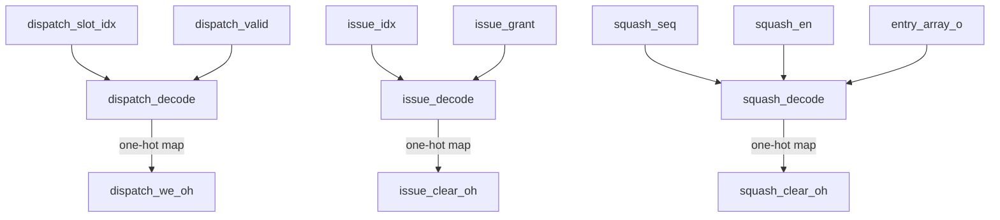

# `iq_wakeup_cam.sv` — Wakeup CAM Array Reference

The `iq_wakeup_cam` module is the container for the Issue Queue's physical instruction storage slots. It instantiates `DEPTH` individual `iq_entry` modules and broadcasts the global wakeup buses to all of them in parallel. It also decodes binary slot indices (such as the target write slot or issued slots) into individual control lines for each entry.

---

## 1. Port Interface Signals

| Port Name | Width | Direction | Description |
| :--- | :---: | :---: | :--- |
| **`clk`** | `1` | `input` | **Clock.** Connects directly to the clock inputs of all sub-slots. |
| **`rst_n`** | `1` | `input` | **Active-Low Reset.** Connects to all sub-slots. |
| **`dispatch_valid`** | `1` | `input` | **Dispatch Write Valid.** Driven by the allocator. High when a new instruction is being loaded. |
| **`dispatch_slot_idx`**| `[$clog2(DEPTH)-1:0]`| `input` | **Target Slot Index.** The binary slot number (0 to 15) allocated for the arriving instruction. |
| **`dispatch_dst_tag`** | `TAG_WIDTH` | `input` | **Dispatch Destination Tag.** Broadcasted to all slots. |
| **`dispatch_src_tag`** | `[NUM_SRC-1:0][TAG_WIDTH-1:0]`| `input` | **Dispatch Source Tags.** Broadcasted to all slots. |
| **`dispatch_src_imm`** | `[NUM_SRC-1:0]` | `input` | **Dispatch Source Immediate mask.** Broadcasted to all slots. |
| **`dispatch_disp_seq`**| `16` | `input` | **Dispatch Ticket Number.** Broadcasted to all slots. |
| **`wakeup_valid`** | `1` | `input` | **Normal Wakeup Valid.** Broadcasted to all slots. |
| **`wakeup_tag`** | `TAG_WIDTH` | `input` | **Normal Wakeup Tag.** Broadcasted to all slots. |
| **`spec_wakeup_valid`**| `1` | `input` | **Speculative Wakeup Valid.** Broadcasted to all slots. |
| **`spec_wakeup_tag`** | `TAG_WIDTH` | `input` | **Speculative Wakeup Tag.** Broadcasted to all slots. |
| **`issue_grant`** | `NUM_PORTS` | `input` | **Port Issue Grants.** A bitmask indicating which execution ports have selected instructions this cycle. |
| **`issue_idx`** | `[NUM_PORTS-1:0][$clog2(DEPTH)-1:0]`| `input` | **Issued Slot Indices.** Array of binary slot numbers selected for execution. |
| **`squash_en`** | `1` | `input` | **Pipeline Squash Trigger.** Asserted when a branch misprediction occurs. |
| **`squash_seq`** | `16` | `input` | **Squash Age Threshold.** The ticket number of the mispredicted branch. |
| **`entry_array_o`** | Array of structs | `output` | **Complete State Array.** An array containing the full state of all `DEPTH` slots, passed up to the selector. |
| **`ready_array_o`** | `DEPTH` | `output` | **Readiness Bitmask.** A bitmask where bit `i` is `1` if slot `i` is valid and ready to issue. |

---

## 2. Internal Signals & Decoding Logic



### 1. Dispatch Slot Decoder (`dispatch_decode`)
```systemverilog
logic [DEPTH-1:0] dispatch_we_oh;
always_comb begin : dispatch_decode
    dispatch_we_oh = '0;
    if (dispatch_valid)
        dispatch_we_oh[dispatch_slot_idx] = 1'b1;
end
```
- **What it does:** Converts the binary target slot index (`dispatch_slot_idx`) into a one-hot map (`dispatch_we_oh`). If slot 5 is targeted, bit 5 of the one-hot map is set to `1`.
- **Why it is here:** Ensures that only the single allocated `iq_entry` writes the incoming instruction payload, while the other entries ignore it.

### 2. Issue Port Clear Decoder (`issue_decode`)
```systemverilog
logic [DEPTH-1:0] issue_clear_oh;
always_comb begin : issue_decode
    issue_clear_oh = '0;
    for (int p = 0; p < NUM_PORTS; p++) begin
        if (issue_grant[p])
            issue_clear_oh[issue_idx[p]] = 1'b1;
    end
end
```
- **What it does:** Scans through all issue ports. If a port is actively issuing an instruction (`issue_grant[p]` is `1`), it decodes its target slot index (`issue_idx[p]`) and sets the corresponding clear wire in `issue_clear_oh` to `1`.
- **Why it is here:** Aggregates clear commands from multiple execution ports. If port 0 issues slot 3 and port 1 issues slot 7, then both slot 3 and slot 7 have their clear wires set, letting them clear themselves simultaneously on the next clock edge.

### 3. Pipeline Squash Decoder (`squash_decode`)
```systemverilog
logic [DEPTH-1:0] squash_clear_oh;
always_comb begin : squash_decode
    for (int i = 0; i < DEPTH; i++) begin
        squash_clear_oh[i] = squash_en
                           && entry_array_o[i].valid
                           && (entry_array_o[i].disp_seq > squash_seq);
    end
end
```
- **What it does:** Compares each active entry's ticket number (`disp_seq`) against the bad branch's ticket number (`squash_seq`). If a squash is active (`squash_en` is `1`), the slot is active (`valid` is `1`), and the slot's ticket number is larger than the branch's (`disp_seq > squash_seq`), it sets the slot's squash clear wire to `1`.
- **Why it is here:** Identifies and flushes only the instructions that were dispatched after the branch misprediction occurred. Instructions dispatched before the branch have smaller or equal sequence numbers and are preserved.

---

## 3. Generative Instantiation Loop (`gen_entry`)

```systemverilog
genvar gi;
generate
    for (gi = 0; gi < DEPTH; gi++) begin : gen_entry
        iq_entry #(
            .TAG_WIDTH (TAG_WIDTH),
            .NUM_SRC   (NUM_SRC),
            .AGE_WIDTH (AGE_WIDTH)
        ) u_entry (
            .clk              (clk),
            .rst_n            (rst_n),
            .dispatch_we      (dispatch_we_oh[gi]),
            ...
            .entry_o          (entry_array_o[gi]),
            .ready_o          (ready_array_o[gi])
        );
    end
endgenerate
```
This compiler construct automatically stamps out `DEPTH` copies of the `iq_entry` module. It maps the decoded single-wire control lines (`dispatch_we_oh[gi]`, `issue_clear_oh[gi]`, `squash_clear_oh[gi]`) directly to the corresponding ports of slot `gi`, while routing the shared data buses (wakeup tags, dispatch tags) to all slots in parallel.

---

## 4. Connections to Other Modules

- **Parent (`iq_top.sv`):** Provides the clocks, resets, incoming instruction payloads, allocated slot indices, and issue grants.
- **Children (`iq_entry.sv`):** Handled in parallel as described above.
- **Sibling (`iq_select.sv`):** Receives the array of entry states (`entry_array_o`) and readiness bitmask (`ready_array_o`) computed by this CAM array.
